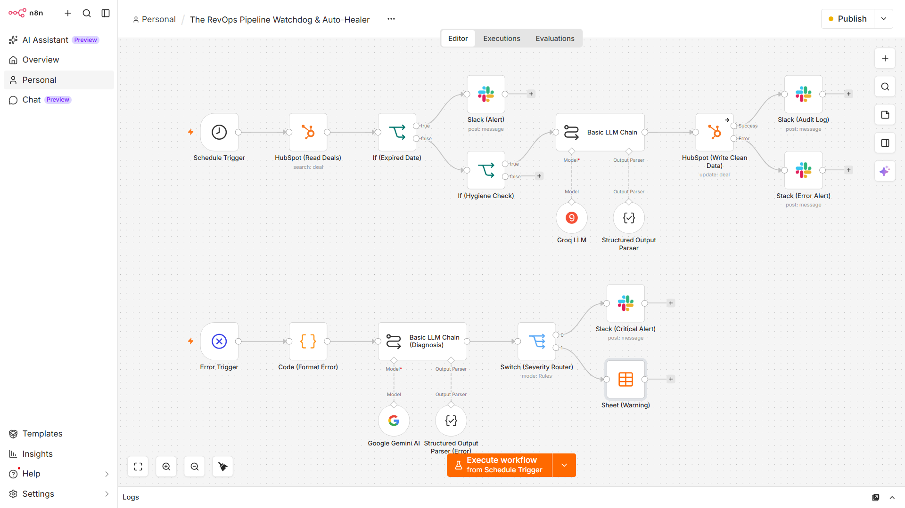

# 🛡️ The RevOps Pipeline Watchdog & Auto-Healer

An enterprise-grade n8n automation architecture that provides automated CRM data hygiene, proactive sales coaching alerts, and a self-healing reactive DevOps catch-net.

## 📌 Business Value

CRM data decay silently ruins financial forecasts, skews marketing attribution, and breaks automated sales outreach. This system acts as an autonomous data janitor and infrastructure guard:

- **Proactive Data Hygiene:** Automatically audits active HubSpot pipeline deals, uses zero-cost LLM inference (Groq/Llama 3) to normalize unstructured company/deal names into clean Title Case, and updates the CRM without human intervention.
- **SLA & Forecast Protection:** Automatically scans for expired close dates and dispatches direct Slack warnings to reps, ensuring quarterly revenue forecasts remain accurate.
- **Granular Batch Resilience:** Features native error branching on database write operations so that a single corrupted record failure never crashes the broader batch sync.
- **Reactive DevOps Auto-Healer:** A completely isolated global error trigger that intercepts catastrophic API or authentication failures, uses Google Gemini to translate raw stack traces into plain-English root causes, and routes alerts by severity tier.

---

## ⚙️ Technical Architecture & Features

This is not a basic linear script; it is built for production resilience across two distinct operational layers:

### Layer 1: The Proactive Data Hygiene & Coaching Engine
1. **Batch Ingestion & Filtering:** Triggered on a schedule to pull active pipeline deals via HubSpot API search filters, deliberately bypassing closed/historical records to conserve compute and protect financial records.
2. **Conditional Time-Traveler Check:** Evaluates expected close dates against dynamic millisecond timestamps (`$now.toMillis()`) to flag stalled or expired deals.
3. **Structured AI Normalization:** Utilizes Groq paired with a strict JSON Structured Output Parser to enforce deterministic data schemas and strip away unwanted text appending.
4. **Item-Level Error Branching:** Routes successful updates to an audit log while catching failed database writes down an isolated error channel.

### Layer 2: The Reactive DevOps Catch-Net
1. **Global Error Listener:** Captures uncaught system exceptions and fatal server crashes instantly.
2. **Contextual Log Parsing:** JavaScript code nodes programmatically isolate execution IDs and build direct debugging links.
3. **AI-Driven Diagnostics:** Ingests raw JSON error payloads into Google Gemini 1.5 Flash to generate a plain-English root cause analysis and severity rating (`CRITICAL` vs `WARNING`).
4. **Intelligent Incident Routing:** Switches and routes critical failures directly to engineering Slack channels while quietly logging non-critical warnings into a Google Sheets ledger.

---

## 🚀 How to Install & Use

1. Download the `RevOps-Pipeline-Watchdog.blueprint.json` file from this repository.
2. Open your n8n instance and create a new workflow.
3. Click the three dots (`...`) in the top right corner and select **Import from File**.
4. Upload the blueprint JSON.
5. Map your respective **HubSpot**, **Slack**, **Groq**, and **Google Gemini** credentials to the corresponding nodes.
6. Toggle the workflow **Active** and run your first test execution!
